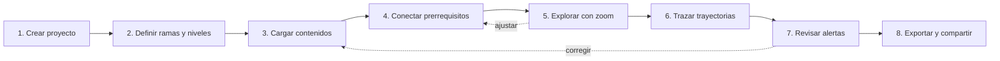

# 🌳 Árbol de Habilidades — Flujo de uso (v0.2)

Herramienta para que **diseñadores, autores y equipos pedagógicos** conviertan una
progresión de aprendizajes en un **árbol de habilidades** (*skill tree*) al estilo de
los videojuegos: navegable, con zoom y con rutas de especialización visibles.

Casos de uso iniciales:

1. **Libro de texto de Pensamiento Computacional** (guías Colombia Programa, Transición–11°).
2. **Curso de formación profesional** (módulos, unidades y competencias).

---

## 1. Del póster al árbol: el modelo de datos

El póster *"Pensamiento Computacional: Progresión de aprendizajes desde transición hasta 11°"*
ya contiene todo lo que un *skill tree* necesita. La herramienta solo lo reorganiza:

| En el póster BC | En el árbol de habilidades | En un curso de FP |
|---|---|---|
| Pensamiento computacional (título) | **Raíz** del árbol | El curso / la cualificación |
| Categorías principales (Conceptos…, Prácticas…, Ciudadanía digital) | **Categorías** que agrupan ramas y terminan en un **perfil** (Programador(a), Innovador(a) con la tecnología, Ciudadano(a) digital) | Perfiles de egreso |
| Ejes (Algoritmos…, Lógica…, Datos…) | **Ramas** (cada una con color e ícono) | Áreas de competencia |
| Grados (Transición, 1°…11°) | **Anillos / niveles** de profundidad | Módulos o trimestres |
| Guías (p. ej. *6.3 Invernaderos*) | **Nodos de misión** | Unidades didácticas |
| Aprendizajes (p. ej. *N0 – Variables en micro:bit*) | **Habilidades** dentro del nodo | Resultados de aprendizaje |
| N0 / N1 / N2 | **Rango** de la habilidad (●○○ / ●●○ / ●●●) | Inicial / intermedio / avanzado |
| Líneas entre guías / *Anexo 1. Grafo guías* | **Prerrequisitos** indispensables y deseables (aristas que "desbloquean") | Dependencias entre unidades |
| — | **Trayectorias** nombradas (rutas de especialización) | Itinerarios formativos |

> Una **habilidad** (p. ej. *Condicionales*) puede aparecer en varios nodos con rangos
> crecientes: N0 en 5.2 → N1 en 6.4 → N2 en 7.1. La herramienta detecta esa
> repetición y la dibuja como una **cadena de mejora**, igual que un juego muestra
> "Bola de fuego I → II → III".

---

## 2. Quién la usa y para qué

| Persona | Necesidad principal |
|---|---|
| **Autor/a de guías** | Ver dónde encaja su guía, qué requiere y qué desbloquea. |
| **Coordinación pedagógica** | Detectar huecos, saltos de nivel y ejes poco desarrollados. |
| **Diseñador/a de curso FP** | Montar itinerarios desde cero y compartirlos con docentes. |
| **Docente / lector final** (solo lectura) | Explorar el mapa y entender la ruta de sus estudiantes. |

---

## 3. Flujo del diseñador (paso a paso)

### Paso 1 · Crear proyecto
- Elegir tipo: **Libro de texto** o **Curso de FP** (cambia el vocabulario: *grado* ↔ *módulo*, *guía* ↔ *unidad*).
- Nombre, autoría, institución.
- Punto de partida: **en blanco**, **plantilla de hoja de cálculo** o **progresión BC precargada** (la del póster).

### Paso 2 · Definir ramas y niveles
- Ramas: nombre, color (de la paleta BC) e ícono.
- Niveles: lista ordenada (Transición…11° o Módulo 1…N).
- Vista previa inmediata del "esqueleto" del árbol vacío.

### Paso 3 · Cargar contenidos
Dos vías que conviven:
- **Importar** la hoja del grafo que ya usa el equipo (Excel / CSV), una fila por guía:
  `Guía | Guía indispensable | Guía deseable | Subcategoría | Subcategoría 2 | Subcategoría 3 | Herramienta computacional`. ✅ Disponible.
- Una segunda hoja **Habilidades**, una fila por habilidad: `Guía | Título | Habilidad | Nivel de dominio | Clave`. ✅ Disponible.
- **Plantilla vacía** descargable con las dos hojas e instrucciones. ✅ Disponible.
- **Editar en pantalla** (✎ Diseñar): doble clic en un hueco del árbol crea el nodo y abre su ficha editable. ✅ Disponible.

### Paso 4 · Conectar prerrequisitos
- Fuente principal: el grafo del equipo (**indispensable** = bloquea, **deseable** = recomienda).
- Lente complementaria: conexiones derivadas cuando una habilidad sube de rango (N0 → N1); la vista *Ambas* muestra dónde coinciden y dónde no.
- Arrastrar desde un nodo a otro para crear la conexión "A desbloquea B" (Mayús = deseable). ✅ Disponible.

### Paso 5 · Explorar con zoom semántico
El nivel de detalle cambia con el zoom, como en un mapa:

| Zoom | Se ve |
|---|---|
| **Alejado** | Raíz + ramas como "constelaciones" de color, con conteo de nodos. |
| **Medio** | Nodos de misión (código + título), anillos de nivel y conexiones. |
| **Cercano** | Habilidades de cada nodo con su rango N0/N1/N2 y herramientas (Scratch, micro:bit, Python…). |

Además: clic en una rama para **enfocarla** (las demás se atenúan), buscador, filtros por
nivel, rama, herramienta o rango, y un **minimapa** para orientarse.

### Paso 6 · Trazar trayectorias
- Seleccionar un nodo → se iluminan **todo lo que requiere** (hacia atrás) y **todo lo que desbloquea** (hacia adelante).
- Guardar rutas con nombre, p. ej. *"De bloques a texto: ScratchJr → Scratch → MakeCode → Python"*.
- Modo "jugador": simular el recorrido de un estudiante marcando nodos como completados.

### Paso 7 · Revisar alertas de diseño
- Nodos huérfanos (sin prerrequisito ni continuidad).
- Saltos de rango (aparece N2 sin un N1 previo).
- Ciclos en los prerrequisitos.
- Ramas desequilibradas (p. ej. *Ética* sin nodos en 6°–9°).

### Paso 8 · Exportar y compartir
- **Archivo del proyecto (JSON)** para seguir editando o pasarlo a otra persona.
- **Imagen / póster** (SVG, PNG alta resolución, PDF) con el look & feel BC, para el libro.
- **Visor interactivo** (HTML de solo lectura) para docentes y estudiantes.

---

## 4. Look & feel (extraído del póster y las guías BC)

| Elemento | Valor |
|---|---|
| Ciruela (titulares, banda superior) | `#4F2B63` |
| Morado (íconos, encabezados alternos) | `#662B80` |
| Azul periwinkle (subtítulos, encabezados alternos, líneas) | `#6898D0` |
| Gris de texto | `#58595B` |
| Fondo de bandas | `#F4F6FB` sobre blanco |
| Tipografía | Basic Sans (Black / Bold / Regular) → equivalente web libre: **Nunito Sans** |
| Recursos gráficos | íconos de línea en círculo con arco azul desplazado, bordes punteados, patrón de ondas tenue, ilustraciones de niñas y niños |

El árbol mantiene la claridad editorial del póster (blanco, aireado, jerárquico) y suma la
sensación "juego": nodos que brillan al desbloquearse, conexiones animadas y rangos con puntos.

---

## 5. Decisiones tomadas

| Tema | Decisión |
|---|---|
| Forma del árbol | **Radial** por defecto (constelación estilo videojuego) + **vista póster** (cuadrícula BC) |
| Carga de contenidos | **Hoja de cálculo + editor en pantalla** |
| Guardado (v1) | **Navegador + archivo JSON** para compartir |
| Primer caso | **Libro de Pensamiento Computacional** con los datos del póster BC |
| Fuente de verdad de las dependencias | **Anexo 1. Grafo guías** del equipo (ejes, herramientas, indispensables y deseables) |
| Progresión por lo que saben | Además de los grados, **5 niveles de aprendizaje** (Exploración → Fundamentos → Práctica → Profundización → Apropiación) para elegir guías según los conocimientos previos; el grado queda como referencia |
| Segundo caso | **Marco de Calidad**: árbol de habilidades institucionales (8 dimensiones × 8 niveles, criterios de M&E, perfil final por dimensión) |

## 6. Propuesta técnica

- **Aplicación web estática**, sin instalación, en la carpeta `arbol-habilidades/` (mismo estilo del repo: HTML + CSS + JS, sin *build*).
- **D3.js** para el dibujo, el zoom y el paneo (incluido en `vendor/`, funciona sin conexión).
- Guardado en el **navegador** + exportar/importar **JSON** (fase 1). Base de datos compartida (Supabase) como opción posterior.
- Datos semilla: la progresión del póster BC transcrita a JSON.

## 7. Fases de construcción

1. ✅ **Visor**: modelo de datos, datos del póster, árbol radial y vista póster con zoom semántico, foco por rama, trayectorias, modo estudiante, diagnóstico y exportación (adelantados de la fase 3).
2. ✅ **Editor**: proyectos propios, crear/editar ramas, niveles, nodos y prerrequisitos; hojas de grafo y habilidades; deshacer.
3. **Calidad y salida**: alertas de diseño, exportación a SVG/PNG/PDF, visor de solo lectura.
4. **Curso de FP**: plantilla y vocabulario propios, prueba con un curso real.
